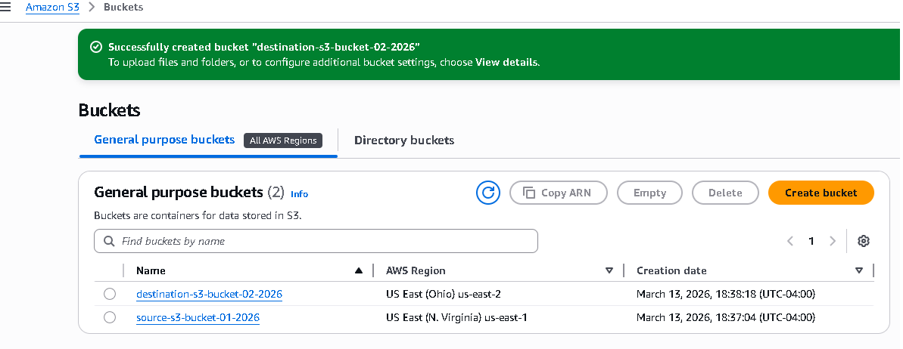
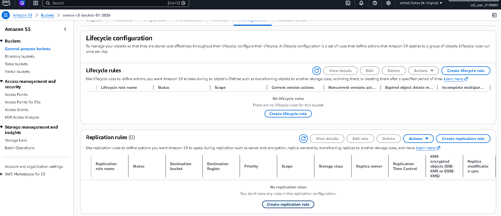
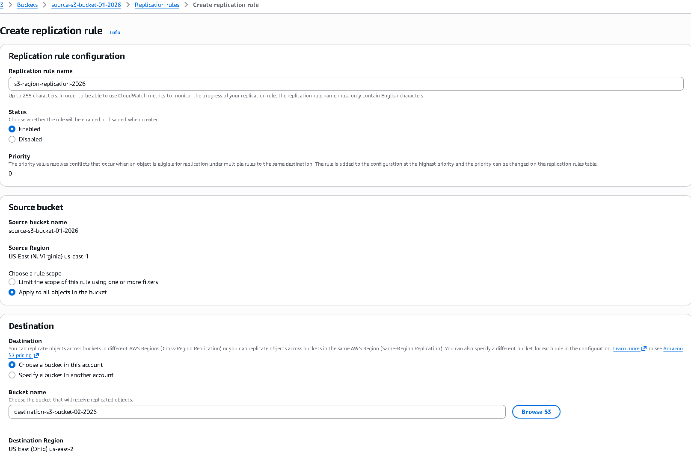
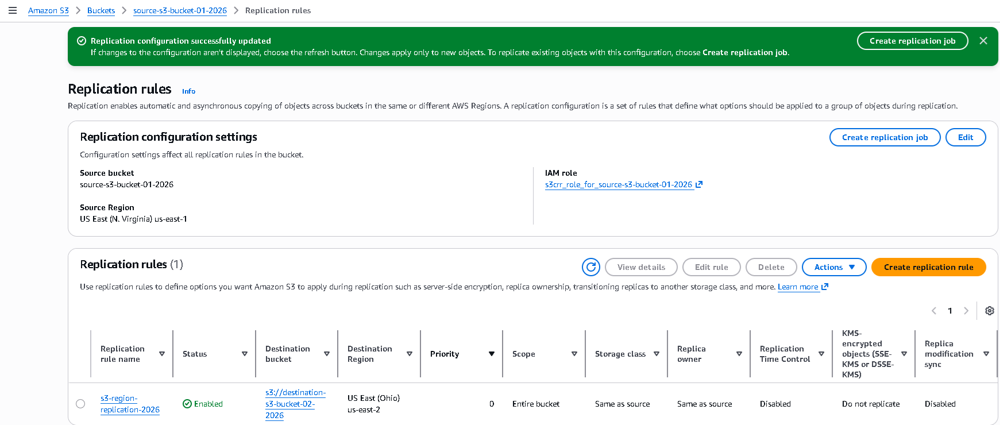
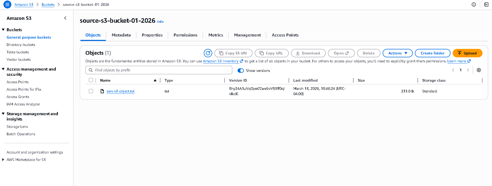
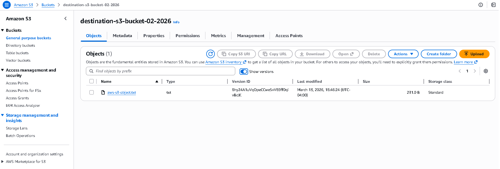

# S3 Cross-Region Replication Setup
## Objective

Configure Cross-Region Replication (CRR) between two Amazon S3 buckets to automatically replicate objects from a source bucket in one AWS region to a destination bucket in another region.

## Tasks Completed

Created two S3 buckets in different regions:

source-s3-bucket-01-2026 in us-east-1 (N. Virginia) – Source bucket
destination-s3-bucket-02-2026 in us-east-2 (Ohio) – Destination bucket

Enabled versioning on both buckets (required for replication).

Opened the Replication configuration in the source bucket and created a new replication rule with:

Rule Name: s3-region-replication-2026
Scope: Entire bucket
Destination Bucket: destination-s3-bucket-02-2026
Destination Region: us-east-2 (Ohio)
Storage Class: Same as source
Replica Owner: Same as source
Replication Time Control: Disabled
KMS-encrypted objects: Do not replicate
Replica modification sync: Disabled

Confirmed that the replication rule was successfully created and enabled.

Uploaded a test object (aws-s3-object.txt) to the source bucket and verified that it was automatically replicated to the destination bucket.

## Screenshots

  
  
  
  
  
 
